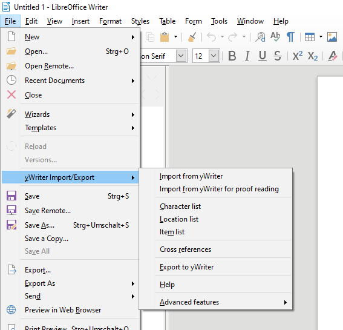

[yWriter](http://spacejock.com/yWriter7.html) is a free word processor written by Australian author and programmer Simon Haynes. yWriter's strengths are structuring novels and controlling the progress during the writing process. With this extension you can combine the advantages of yWriter 7 with the advantages of LibreOffice.

## Features

- Generate a "standard manuscript" formatted **ODF text document (ODT)** from a yWriter 7 project.
- Load yWriter 7 chapters and scenes into an OpenDocument file with chapter and scene markers for **proof reading** and writing back.
- Generate a **brief synopsis** with chapter and scene titles from a yWriter 7 project.
- Generate a **character list** that can be edited in Office Calc and written back to yWriter format.
- Generate a **location list** that can be edited in Office Calc and written back to yWriter format.
- Generate an **item list** that can be edited in Office Calc and written back to yWriter format.
- Generate an OpenDocument text file containing navigable **cross references** , such as scenes per character, characters per tag, etc.
- Generate a new yWriter 7 project from a **work in progress** or an **outline** .
- The extension is ready for internationalization with GNU gettext. A German localization with help pages in German is provided. 

You can find more information on the [help pages](help).

## Requirements

- [LibreOffice](https://www.libreoffice.org/) version 5.4 or more recent. LibreOffice 7 is highly recommended.

**OpenOffice users:** *This extension can not be installed on OpenOffice. An OpenOffice variant can be found [here]( https://peter88213.github.io/pywoo).*

## Download and install {#download}

[Download the latest release (version 1.38.3)](https://raw.githubusercontent.com/peter88213/yw-cnv/main/dist/yw-cnv-L-1.38.3.oxt)

- Installation right at download, by double-clicking on the downloaded 
 file, or via the LibreOffice Extension Manager. Instructions can be found [here](https://wiki.documentfoundation.org/Documentation/HowTo/install_extension).
- After installation (and Office restart) you find a new "yWriter Import/Export" submenu in the "Files" menu.
- If no additional "yWriter Import/Export" submenu shows up in the "Files" menu, please look at the "Tools" > "Extensions" menu.
- On Linux (especially Ubuntu), make sure that the *libreoffice-script-provider-python* package is installed.

[Changelog](changelog)

## Get updates

This extension supports the update mechanism of LibreOffice. You can let the Extension Manager check for updates from time to time to get the latest release.

---

## Credits

[OpenOffice Extension
Compiler](https://wiki.openoffice.org/wiki/Extensions_Packager#Extension_Compiler)
by Bernard Marcelly.

Frederik Lundh published the [xml pretty print algorithm](http://effbot.org/zone/element-lib.htm#prettyprint).

Andrew D. Pitonyak published useful Macro code examples in [OpenOffice.org Macros Explained](https://www.pitonyak.org/OOME_3_0.pdf).

## License

This extension is distributed under the [MIT
License](http://www.opensource.org/licenses/mit-license.php).

---

## See also

[The "curly" extensions for OpenOffice and LibreOffice](https://peter88213.github.io/curly/)

[The StyleSwitcher extension for OpenOffice and LibreOffice](https://peter88213.github.io/StyleSwitcher/)

[The emph extension for OpenOffice and LibreOffice](https://peter88213.github.io/emph/)

[The yW2OO standalone converter for yWriter and OpenOffice/LibreOffice](https://peter88213.github.io/yW2OO/)
