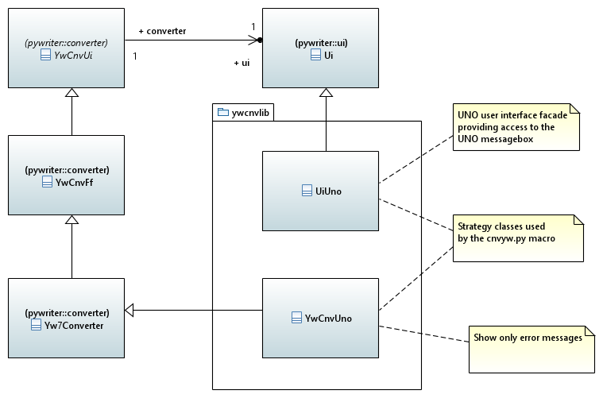
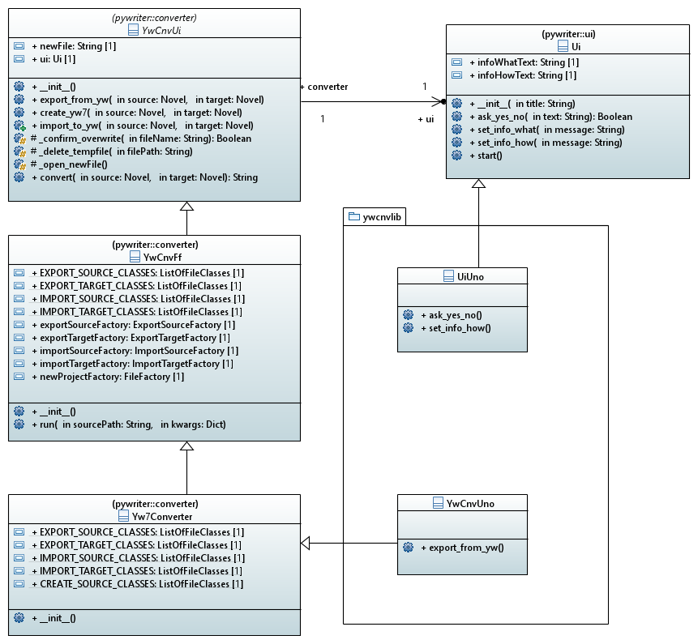

[home](../index) > Project class library overview

---

# Project class library overview

## Modules of the ywcnvlib package

**yw_cnv_uno** -- Provide a converter class for universal import and export. 
**ui_uno** -- Provide a UNO user interface facade class.

## Classes

### Overview

### Detailed class diagram

*Click on the diagram to enlarge*

